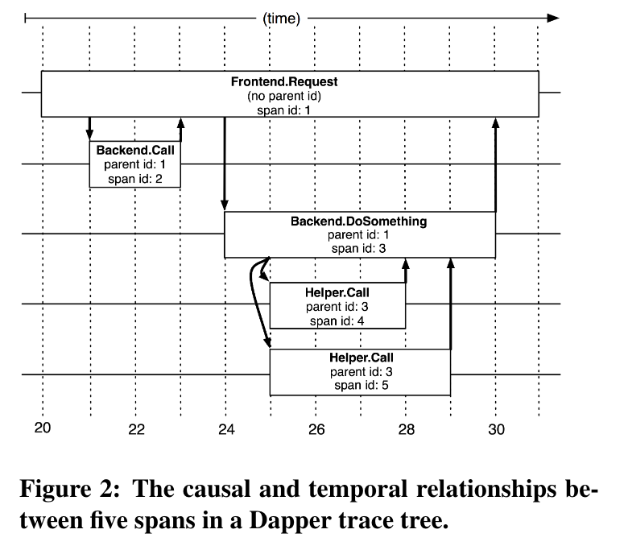

# Dapper, a Large-Scale Distributed Systems Tracing Infrastructure

[36356.pdf](assets/36356-20240127141133-pe51q7y.pdf)

# Two solutions to associate all record entries with a given initiator

​​

## Black-box

use statistical regression techniques to infer that association

* pro: portable
* con: need more data to gain sufficient accuracy due to thier reliance on statistical inference

‍

## Annotation-based schemes

ely on applications or middleware to explicitly tag every record with a global identifier that links these message records back to the originating request

* pro:
* con: need to instrument programs

  * **solution**: In our environment, since all applications use the same threading model, control flow and RPC system, we found that it was possible to restrict instrumentation to a small set of common libraries

# Trace trees and spans

* a Dapper trace tree

  * 	​	​

    **Tree Node**: spans
  * **Edge**: relationship between a span and its parent span

* a single span

  * ​​

# Instrumentation point

Entry:

* When a thread handles a traced control path
* Dapper attaches a *trace context* to thread-local storage

Defer computation or made asynchronous

* all callbacks store the *trace context* of their creator
* *trace context* is associated with the appropriate thread when callback is invoked

Inter-process communication

* span and trace ids are transmitted from client to server for traced RPCs

# Annotation API

* Textual annotation

​​

* Key-value annotation

# Trace collection

​​

## Out-of-band trace collection

The Dapper system as described performs trace logging and collection out-of-band with the request tree itself. Because:

* in-band collection scheme affect application network dynamics

* in-band collection schemes assume that all RPCs are perfectly nested

# Security and privacy considerations

Default:

* Dapper stores the name of RPC methods but does not log any payload data at this time.

Opt-in:

* application-level annotations to associate any data

Not anticipated benifits:

* monitor whether applications are satisfying security policies through proper levels of authentication

# Tracing Overhead

## Generation Overhead

Trace generation overhead is the most critical segment of Dapper's performance footprint, since it can harder be turned off in an emergency.

**Most important sources of trace generation overhead:**

* creating and destroying spans and annotations and logging them to local disk

**Creation time cost(average, measured on a 2.2GHz x86 server):**

* root span: 204 ns
* non-root span: 176 ns
* additional span annotation:

  * if not sampled for tracing: 9 ns
  * if sampled(annotated the trace with a string literal): 40 ns

the difference is the added cost of allocating a globally unique trace id for root spans

## Collection overhead

* Dapper daemon is restricted to the lowest possible priority in the kernel scheduler

## Effect on production workloads

# Adaptive sampling

The Dapper overhead attributed to any given process is proportional to the number of traces that process samples per unit time.

# Coping with aggresive sampling

low sampling probabilities - often as low as 0.01% for high-traffic services - does not hinder most important analysis for high-throughput services

>  If a notable execution pattern surfaces  
> once in such systems, it will surface thousands of times.

# Additional sampling during collection

Why:

* to maintain flexibility around both the material resource requirements and the cumulative Bigtable write throughput

How:

* hash trace id  as a scalar z (0 <= z <= 1)
* If z is less than our collection sampling coefficient, we keep the span and write it to the Bigtable

Remark

* higher runtime sampling rate, and throttle that write rate with secondary sampling coefficient in the collection system

# General-purpose Dapper Tools

## Depot API

to access trace data:

* access by trace id
* user function is inovked for every collected trace within a user-specified time window

* Index access: service name, host machine, ts
